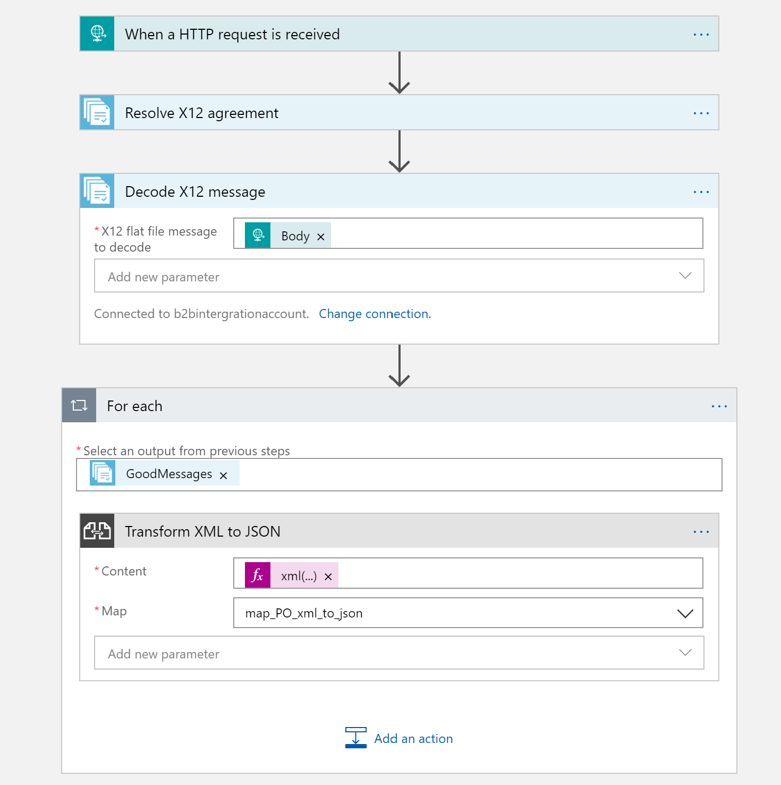

# Building B2B (EDI X12) workflow using Azure LogicApps

This repository is a placeholder for building a logic app that can be used to B2B Integration flow using EDI X12 standard. The sample flow receives purchase orders (X12 850) from trading partners and process it downstream.

## Folder Structure

1. Templates
    - following the guidelines of "automate logic apps" split the whole template into specialized json files
2. Artifacts
    - liquid file to map xml to a custom order format
    - sample 850 Purchase order in X12
    - x12 850 xsd to be uploaded to integration account, to be used on agreement between partners
3. Powershell
    a. shared-deploy.ps1, deploys shared components like integration account, storage account
    b. logic-app-deploy.ps1, deploys connectors to integration account and storage account and then the logic app itself
    c. full-deploy.ps1, can just execute this master script alone and it would achieve the same desired state as above

## Work In progress

1. using metadata on integration account artifacts to build reusable patterns across multiple partners
2. automate deployments for logic apps to dev/test/prod environments using the guidelines in the references section
    - have complete separating logic app template, logic app definition, logic app definition paramters into separate json files
    - have tested executing the deploy scripts and ensure resources have been provisioned correctly
    - have to figure out how to add items from artifact folder as part of provisioning integration account like maps, schemas, partners, agreements

## References

1. [Logic Apps - Automate deployment](https://github.com/Azure-Samples/azure-logic-apps-deployment-samples)
2. [Logic Apps Template Generator](https://github.com/jeffhollan/LogicAppTemplateCreator)
3. [Logic Apps - B2B Integration Strategy](https://github.com/Azure/logicapps/blob/master/articles/microsoft-integration-with-azure-logic-apps.pdf)

## Logic App Definition (Current)

Convert each good message to xml, with this expression:
xml(base64ToBinary(items('ReplaceWithForeachActionName')?['Payload']))